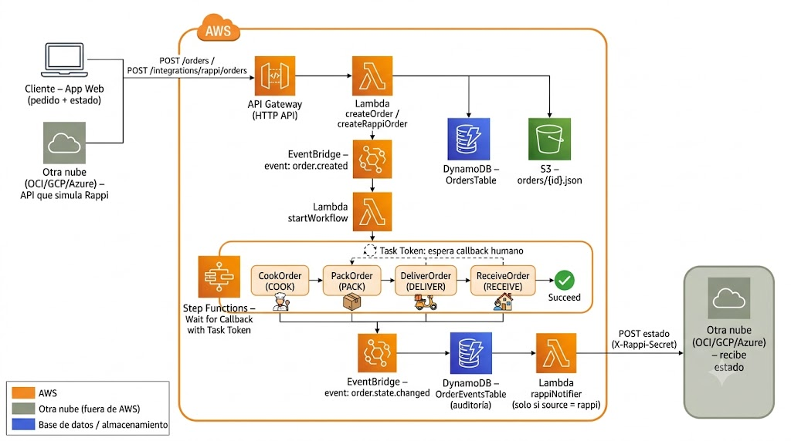

# Madam Tusan Backend Serverless

Backend serverless en **AWS** para `madamtusan`. Arquitectura multi-tenant, basada
en eventos y multi-nube: todo el backend vive en AWS excepto las dos APIs que
simulan Rappi, que se implementan en otra nube (OCI/GCP/Azure) por otro
integrante del equipo y solo consumen/llaman los endpoints documentados en la
sección [Integración multi-nube (Rappi)](#integración-multi-nube-rappi).

Desplegado con **Serverless Framework v4**.

## Servicios de AWS utilizados

| Servicio | Uso en este proyecto |
|---|---|
| **API Gateway (HTTP API)** | Expone todos los endpoints REST (`provider.httpApi` en `serverless.yml`) |
| **Lambda** | 22 funciones: autenticación, usuarios, productos, órdenes, workflow, notificaciones |
| **DynamoDB** | 5 tablas: usuarios, tokens, órdenes, eventos de orden, productos |
| **S3** | 1 bucket: imágenes de productos, assets del sitio, avatars, respaldo JSON de órdenes |
| **Step Functions** | Máquina de estados del pedido con patrón *Wait for Callback with Task Token* |
| **EventBridge** | Bus `default`: dispara el workflow al crear una orden y notifica cada cambio de estado |
| **SNS** | Tópico de notificaciones por email (confirmación de pedido, suscripción de clientes) |
| **IAM** | Rol `LabRole` (AWS Academy Learner Lab) para todas las funciones y la state machine |

## Arquitectura y flujo de eventos



## Lambdas

### Autenticación y usuarios

| Función | Handler | Endpoint | Descripción |
|---|---|---|---|
| `registerUser` | `handler.register_user` | `POST /auth/register` | Auto-registro público de clientes (rol `customer`) |
| `login` | `handler.login` | `POST /auth/login` | Genera un token Bearer válido 24h, guardado en `AuthTokensTable` |
| `createUser` | `handler.create_user` | `POST /users` | Un admin crea trabajadores (`cook`, `pack`, `deliverer`, `worker`, `admin`) |
| `listUsers` | `handler.list_users` | `GET /users` | Lista usuarios del tenant (solo admin) |
| `deleteUser` | `handler.delete_user` | `DELETE /users/{userId}` | Elimina un usuario (solo admin) |
| `updateProfile` | `handler.update_profile` | `PUT /users/profile` | Actualiza email/teléfono/dirección/avatar del usuario autenticado |
| `subscribeEmail` | `handler.subscribe_email` | `POST /users/email-subscription` | Suscribe/desuscribe el email del usuario al tópico SNS |
| `uploadAvatar` | `handler.upload_avatar` | `POST /users/avatar` | Sube avatar (base64) a S3 (`avatars/{user_id}.jpg`) |

### Productos y assets

| Función | Handler | Endpoint | Descripción |
|---|---|---|---|
| `listProducts` | `handler.list_products` | `GET /products` | Lista productos, filtrable por `?category=` (usa GSI `CategoryIndex`) |
| `getProduct` | `handler.get_product` | `GET /products/{productId}` | Detalle de un producto |
| `listAssets` | `handler.list_assets` | `GET /assets` | Devuelve logos/banners/secciones (`site-assets/`) con URLs firmadas de S3 |

### Órdenes y workflow

| Función | Handler | Endpoint / Trigger | Descripción |
|---|---|---|---|
| `createOrder` | `handler.create_order` | `POST /orders` | Cliente autenticado crea una orden (`source: web`) |
| `createRappiOrder` | `handler.create_rappi_order` | `POST /integrations/rappi/orders` | Entrada dedicada para la API de la otra nube (valida `X-Rappi-Secret`) |
| `confirmRappiReceived` | `handler.confirm_rappi_received` | `POST /integrations/rappi/orders/{orderId}/receive` | Simula que el cliente Rappi recibió el pedido, cierra el paso `RECEIVE` |
| `listOrders` | `handler.list_orders` | `GET /orders` | Lista órdenes del tenant (FIFO por `created_at`); un `customer` solo ve las suyas |
| `getOrder` | `handler.get_order` | `GET /orders/{orderId}` | Detalle de una orden, incluye `history` completo |
| `deleteOrder` | `handler.delete_order` | `DELETE /orders/{orderId}` | Elimina una orden (solo admin) |
| `startWorkflow` | `handler.start_workflow` | EventBridge `order.created` | Arranca la ejecución de Step Functions para la orden |
| `taskHandler` | `handler.task_handler` | Invocado por Step Functions (`waitForTaskToken`) | Guarda el `taskToken` del paso actual y marca `WAITING_<STEP>` |
| `taskCallback` | `handler.submit_task_callback` | `POST /tasks/callback` | Un trabajador (o cliente, en `RECEIVE`) completa el paso activo usando su rol |
| `workflowFailure` | `handler.mark_workflow_failed` | Invocado por Step Functions (rama `Catch`) | Marca la orden como `FAILED` o `EXPIRED` (timeout) |
| `rappiNotifier` | `handler.rappi_notifier` | EventBridge `order.state.changed` | Si `source == rappi`, hace `POST` a `RAPPI_API_URL` con el nuevo estado |

## Tablas DynamoDB

| Tabla | Partition key | GSI | Contenido |
|---|---|---|---|
| `UsersTable` | `tenant_user_id` (`{tenant}#{user_id}`) | — | Usuarios, password hasheado (PBKDF2), rol |
| `AuthTokensTable` | `token` | — | Tokens Bearer con expiración (24h) |
| `OrdersTable` | `order_id` | `TenantIndex` (`tenant_id`) | Orden completa: items, estado, `workflow_step`, `task_token`, `history[]` |
| `OrderEventsTable` | `event_id` | `TenantEventsIndex` (`tenant_id`) | Auditoría de todos los eventos publicados en EventBridge |
| `ProductsTable` | `product_id` | `CategoryIndex` (`category`) | Catálogo de productos |

Todas usan `PAY_PER_REQUEST` (on-demand) y `tenant_id` para aislar datos entre
tenants (multi-tenancy).

## Bucket S3 (`madamtusan-backend-assets-{stage}-{accountId}`)

```
madamtusan-backend-assets-dev-123456789/
├── products/               # Imágenes de productos (cargadas manualmente o con load_products.py)
├── site-assets/            # Logos, banners y secciones (poblado por load_products.py)
│   ├── branding/
│   ├── banners/
│   └── sections/
├── avatars/                # Avatares de usuario ({user_id}.jpg)
└── orders/                 # Respaldo JSON de cada orden ({order_id}.json)
```

Las imágenes de productos y assets se sirven mediante **URLs firmadas** (`_signed_s3_url`,
expiran en 1 hora) generadas al vuelo en `listProducts`, `getProduct` y `listAssets`.

## Step Functions: workflow del pedido

State machine `madamtusan-backend-workflow-{stage}` (patrón **Wait for Callback
with Task Token**, `arn:aws:states:::lambda:invoke.waitForTaskToken`):

```
CookOrder (COOK) -> PackOrder (PACK) -> DeliverOrder (DELIVER) -> ReceiveOrder (RECEIVE) -> CompleteOrder
```

- Cada estado invoca `taskHandler`, que guarda `$$.Task.Token` en la orden y
  publica `WAITING_<STEP>`.
- La ejecución **queda pausada** hasta que alguien llama `POST /tasks/callback`
  (o `POST /integrations/rappi/orders/{orderId}/receive` para el paso
  `RECEIVE` de pedidos Rappi), lo que dispara `sf.send_task_success` con el
  `taskToken` guardado y el flujo continúa al siguiente estado.
- Cada estado tiene `Retry` (3 intentos, backoff x2) ante errores transitorios
  de Lambda y `TimeoutSeconds: 3600`; si falla o expira, cae en `RecordFailure`
  → Lambda `workflowFailure` → estado `FAILED`/`EXPIRED`.

| Paso (`workflow_step`) | Rol requerido | Quién lo completa |
|---|---|---|
| `COOK` | `cook` (o `worker`/`admin`) | Cocinero prepara la comida |
| `PACK` | `pack` (o `worker`/`admin`) | Despachador empaca el pedido |
| `DELIVER` | `deliverer` (o `worker`/`admin`) | Repartidor entrega al cliente |
| `RECEIVE` | `customer` (dueño de la orden) o `admin` | Cliente confirma recepción (web) o `confirmRappiReceived` (Rappi) |

Cada orden mantiene un arreglo `history[]` con, por cada paso: `started_at`,
`completed_at`, `duration_seconds` y `actor` (quién lo atendió) — esto es lo
que permite a la app de trabajadores conocer en todo momento el estado del
workflow, los tiempos de cada etapa y quién la atendió, y armar el dashboard
resumen a partir de `GET /orders`.

Ejemplo simplificado de una orden:

```json
{
  "order_id": "uuid",
  "tenant_id": "madamtusan",
  "source": "web",
  "status": "WAITING_PACK",
  "workflow_step": "PACK",
  "task_token": "AAAA...",
  "history": [
    { "event": "CREATED", "step": "ORDER_CREATED", "timestamp": "...", "actor": "cliente1" },
    { "event": "STARTED", "step": "COOK", "started_at": "...", "actor": "system" },
    { "event": "COMPLETED", "step": "COOK", "started_at": "...", "completed_at": "...", "duration_seconds": 420, "actor": "cocinero1" },
    { "event": "STARTED", "step": "PACK", "started_at": "...", "actor": "system" }
  ]
}
```

## EventBridge

Bus `default`, `source: madamtusan.orders`:

| `detail-type` | Publicado por | Consumido por |
|---|---|---|
| `order.created` | `_create_order_record` (al crear una orden) | `startWorkflow` (arranca Step Functions) |
| `order.state.changed` | Cada cambio de estado: creación, `taskHandler`, `_complete_active_step`, `mark_workflow_failed`, `delete_order` | `rappiNotifier` (reenvía a la otra nube si `source == rappi`) |

Todo evento publicado también se guarda en `OrderEventsTable` para auditoría
(`_publish_event`).

## SNS

Tópico `madamtusan-backend-orders-notifications-{stage}`:

- Suscripción por email fija a `ADMIN_EMAIL` (definida en `serverless.yml`).
- Cada cliente puede suscribir/desuscribir su propio email vía
  `POST /users/email-subscription` (filtrado por `tenant_id` con
  `FilterPolicy`).
- `_send_order_notification` envía un email de confirmación al cliente cuando
  crea una orden (si está suscrito).

## Integración multi-nube (Rappi)

El backend AWS expone y consume dos contratos para que otro integrante del
equipo implemente **ambas APIs en OCI, GCP o Azure**, simulando a Rappi.
Ambos lados requieren un secreto compartido enviado en el header
`X-Rappi-Secret` (variable `RAPPI_SHARED_SECRET`).

### 1. API externa origina el pedido (AWS la recibe)

La API de la otra nube reenvía el pedido del cliente Rappi a AWS:

```http
POST https://<api-id>.execute-api.us-east-1.amazonaws.com/integrations/rappi/orders
X-Rappi-Secret: <RAPPI_SHARED_SECRET>
Content-Type: application/json

{
  "tenant_id": "madamtusan",
  "customer_id": "rappi-cliente-123",
  "items": [
    { "product_id": "chaufa-de-pollo", "name": "Chaufa De Pollo", "quantity": 1, "price": 32 }
  ]
}
```

Respuesta `201`:

```json
{ "order_id": "uuid", "message": "Rappi order accepted" }
```

### 2. AWS notifica cada cambio de estado (la otra nube lo recibe)

AWS hace `POST` a `RAPPI_API_URL` (variable de entorno) en cada paso del
workflow, solo para órdenes con `source: rappi`:

```http
POST https://<api-externa>/estado
X-Rappi-Secret: <RAPPI_SHARED_SECRET>
Content-Type: application/json

{
  "tenant_id": "madamtusan",
  "order_id": "uuid",
  "status": "WAITING_COOK",
  "step": "COOK",
  "worker_id": "cocinero1",
  "timestamp": "2026-07-04T12:00:00Z"
}
```

Estados posibles: `RECEIVED`, `WAITING_COOK`, `COOK_COMPLETED`, `WAITING_PACK`,
`PACK_COMPLETED`, `WAITING_DELIVER`, `DELIVER_COMPLETED`, `WAITING_RECEIVE`,
`COMPLETED`, `FAILED`, `EXPIRED`. La API externa debe responder `2xx`.

### 3. Confirmar recepción desde Rappi

Cuando el cliente Rappi recibe la comida, la otra nube llama:

```http
POST https://<api-id>.execute-api.us-east-1.amazonaws.com/integrations/rappi/orders/{orderId}/receive
X-Rappi-Secret: <RAPPI_SHARED_SECRET>
Content-Type: application/json

{}
```

Solo funciona si el pedido está en `WAITING_RECEIVE`. Responde:

```json
{ "message": "Receipt confirmed", "status": "COMPLETED" }
```

## Roles y autenticación

- **Sin Cognito**: autenticación manual con tokens Bearer guardados en
  `AuthTokensTable` (`generate_secure_token`, expiran en 24h).
- Passwords con PBKDF2-HMAC-SHA256 (120k iteraciones) + salt (`utils.py`).
- Roles: `customer`, `worker`, `cook`, `pack`, `deliverer`, `admin`.
- Los clientes se auto-registran en `POST /auth/register`. Trabajadores y
  admins solo los crea un admin existente vía `POST /users`.

## Variables de entorno

| Variable | Descripción |
|---|---|
| `RAPPI_API_URL` | URL de la API externa que recibe los cambios de estado |
| `RAPPI_SHARED_SECRET` | Secreto compartido con la otra nube (`X-Rappi-Secret`) |
| `TENANT_ID` | Tenant por defecto (`madamtusan`) |
| `ADMIN_EMAIL` | Email suscrito al tópico SNS de notificaciones |

## Despliegue

```bash
npm install -g serverless
cd /home/toritosomali/CLOUD/ProjectoCloud-Backend-Serverless
export RAPPI_API_URL="https://tu-api-externa.example.com/estado"
export RAPPI_SHARED_SECRET="un-secreto-largo"
export ADMIN_EMAIL="admin@madamtusan.com"
serverless deploy --stage dev
```

El bucket `madamtusan-backend-assets-dev-<ACCOUNT_ID>` se crea automáticamente.

## Endpoints (resumen)

- `POST /auth/register` — registro público de clientes
- `POST /auth/login` — login, devuelve token Bearer
- `POST /users` — admin crea trabajadores/admins
- `GET /users` — admin lista usuarios
- `DELETE /users/{userId}` — admin elimina usuario
- `PUT /users/profile` — usuario actualiza su perfil
- `POST /users/email-subscription` — suscribir/desuscribir email
- `POST /users/avatar` — subir avatar
- `GET /products` — lista productos (`?category=`)
- `GET /products/{productId}`
- `GET /assets` — logos/banners/secciones
- `POST /orders` — crear orden (cliente web)
- `POST /integrations/rappi/orders` — crear orden desde la otra nube (Rappi)
- `POST /integrations/rappi/orders/{orderId}/receive` — confirmar recepción Rappi
- `GET /orders` — listar órdenes (FIFO)
- `GET /orders/{orderId}`
- `DELETE /orders/{orderId}` — admin elimina orden
- `POST /tasks/callback` — trabajador/cliente completa el paso activo del workflow

## Scripts

### Cargar productos y assets del sitio

`load_products.py` lee un archivo de texto con URLs de imágenes, las sube a
S3 (`site-assets/{branding,banners,sections}/` o `site-assets/products/`) y
crea/actualiza los productos en DynamoDB (categoría y precio tomados de
`PRODUCT_DATA`):

```bash
python load_products.py urls.txt bucket-config.json
```

`bucket-config.json`:

```json
{
  "bucket_name": "madamtusan-backend-assets-dev-ACCOUNT_ID",
  "region": "us-east-1",
  "products_table": "madamtusan-backend-products-dev"
}
```

### Subir un asset individual

```bash
aws s3 cp logo.png s3://madamtusan-backend-assets-dev-123456789/assets/logo.png
```

## Carrito de usuario

El carrito no se guarda en este backend. Se maneja en la UI/frontend y solo se
envía al backend cuando el usuario confirma el pedido con `POST /orders`.

## Ejemplo de flujo completo

1. Cliente crea usuario y hace login (`POST /auth/register`, `POST /auth/login`).
2. Cliente envía `POST /orders` con `items` (o la otra nube llama
   `POST /integrations/rappi/orders`).
3. La Lambda crea la orden en DynamoDB + S3 y publica `order.created` en EventBridge.
4. `startWorkflow` arranca Step Functions.
5. Cada etapa humana (`COOK`, `PACK`, `DELIVER`, `RECEIVE`) queda en espera con
   un Task Token.
6. La app de trabajadores llama `POST /tasks/callback` con `order_id` para
   completar el paso activo según su rol.
7. Si la orden es `source: rappi`, cada cambio de estado dispara
   `rappiNotifier`, que notifica a la otra nube.
8. Al llegar a `RECEIVE`, el cliente (web) o la API Rappi (`.../receive`)
   confirma la recepción y la orden queda `COMPLETED`.

## Notas

- Backend serverless y multi-tenant, sin Cognito.
- Multi-nube: solo las dos APIs de Rappi viven fuera de AWS; todo lo demás
  (Amplify para las apps web, si aplica) debe documentarse por separado si lo
  implementa otro integrante del equipo.
- Para pruebas locales: `serverless invoke local --function registerUser --path sample-register.json`.
